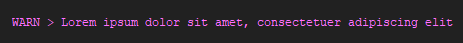
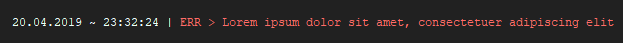
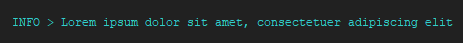
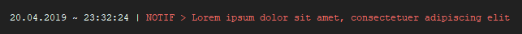
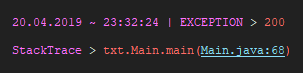
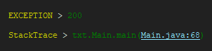

# minimalLog
A minimalistic log library that makes console logs more viewable and easier to handle

[**Changelog**](CHANGELOG.md)

[**Download**](https://github.com/Drainyyyy/minimalLog/releases)

[**Support**](README.md#support)

[**Contributing**](CONTRIBUTING.md)

## Installation
### General

---
- [Download](https://github.com/Drainyyyy/minimalLog/releases) the latest version of minimalLog

**Following steps are just to make things easier**
- If you have more than one file downloaded (e.g. you downloaded the source/javadoc too)
    - Move all files to one folder where no other libraries are in (to make things easier)
### IntelliJ

---
- Click 'File' in the upper left corner
- Open 'Project Structure'
- Go to 'Libraries'
- Add a new one by clicking the '+'
- Navigate to the directory where the jar(s) are in
- Add the folder where the jar(s)
- You now should have added minimalLog to your project

### Other IDEs

---
Feel free to add installation-guides

## Support
If you got any trouble you can create an issue [**here**](https://github.com/Drainyyyy/manageStream/issues).

Please describe your problem detailed, so I can understand it.

If you want faster support/easier chatting you can join [**my discord server**](https://www.drainyyy.me/s/discord).

## Features
With minimalLog you can declare one or more specific and configurable log types.

Basically there are 2 different main types that can be configured by themselves too:
- UncoloredLog
- ColoredLog

### UncoloredLog and ColoredLog

---
These two are pretty much the same except that (how the name already says) UncoloredLog
does not support colors.

*Note: colors are not shown in the default windows command prompt. For showing colors on windows you will need something like ConEmu.*

#### Notification-types
When logging something into the console you can choose between 5 options:
- information
- notification
- warning
- error
- exceptionHandler (only for exceptions)

The difference between the first 4 only is the text-type in form of a prefix shown in the console log and the default color in ColoredLog. 
All of them take a string as parameter which will be printed out in the console.
The UncoloredLog and ColoredLog have the same text. The only difference is that ColoredLog adds [ANSI escape codes](http://www.lihaoyi.com/post/BuildyourownCommandLinewithANSIescapecodes.html)
to the prefix and text (not to the timestamp).

The exceptionHandler just takes the Exception e as input and prints out the error message and the stacktrace.

#### Configurations
- Toggle timestamp
- Format timestamp how you like with SimpleDateFormat
- Change divider between text-type and text (typeDiv)
- Change divider between timestamp and text-type (timestampDiv)
- ColoredLog specials
    - Change colors for different text-types
    
#### Code Examples
```java
package com.drainyyy.github.minimalLog;

import java.lang.Exception;

import com.github.drainyyyy.minimalLog.ColoredLog;
import com.github.drainyyyy.minimalLog.Colors;
import com.github.drainyyyy.minimalLog.UncoloredLog;

public class Main {
    
    private static UncoloredLog uLog1 = new UncoloredLog(">"); //without timestamp
    private static UncoloredLog uLog2 = new UncoloredLog(">", new SimpleDateFormat("dd.MM.yyyy ~ HH:mm:ss"), "|"); //with timestamp
    
    private static ColoredLog cLog1 = new ColoredLog(">"); //without timestamp, default colors
    private static ColoredLog cLog2 = new ColoredLog(">", new SimpleDateFormat("dd.MM.yyyy ~ HH:mm:ss"), "|"); //with timestamp, default colors
    
    /*
    without timestamp
    configured colors:
    - information: cyan
    - notification: red
    - warning: yellow
    - error: blue
    - exceptionHandlerText: green
    - exceptionHandlerKeywords: yellow
     */
    private static ColoredLog cLog3 = new ColoredLog(">", Colors.cyan, Colors.red, Colors.yellow, Colors.blue, Colors.green, Colors.yellow);
    
    /*
        with timestamp
        configured colors:
        - information: cyan
        - notification: red
        - warning: yellow
        - error: blue
        - exceptionHandlerText: green
        - exceptionHandlerKeywords: yellow
         */
    private static ColoredLog cLog4 = new ColoredLog(">", new SimpleDateFormat("dd.MM.yyyy ~ HH:mm:ss"), "|", 
                                                    Colors.cyan, Colors.red, Colors.yellow, Colors.blue, Colors.green, Colors.yellow);
    
    private static ColoredLog cLogErr1 = new ColoredLog(">", new SimpleDateFormat("dd.MM.yyyy ~ HH:mm:ss"), "|"); //with timestamp, default colors
    
    /*
        without timestamp
        configured colors:
        - information: cyan
        - notification: red
        - warning: yellow
        - error: blue
        - exceptionHandlerText: green
        - exceptionHandlerKeywords: yellow
         */
    private static ColoredLog cLogErr2 = new ColoredLog(">", Colors.cyan, Colors.red, Colors.yellow, Colors.blue, Colors.green, Colors.yellow);
    
    public static void main(String[] args) {
        
        uLog1.information("Lorem ipsum dolor sit amet, consectetuer adipiscing elit");
        uLog2.notification("Lorem ipsum dolor sit amet, consectetuer adipiscing elit");
        
        cLog1.warning("Lorem ipsum dolor sit amet, consectetuer adipiscing elit");
        cLog2.error("Lorem ipsum dolor sit amet, consectetuer adipiscing elit");
        cLog3.information("Lorem ipsum dolor sit amet, consectetuer adipiscing elit");
        cLog4.notification("Lorem ipsum dolor sit amet, consectetuer adipiscing elit");
        
        try {
            throw new Exception("200");
        } catch (Exception e) {
            cLogErr1.exceptionHandler(e);
            cLogErr2.exceptionHandler(e);
        }
        
    }
}
```

#### Output (UncoloredLog)
1. Information      (without timestamp)     [uLog1]
2. Notification     (with timestamp)        [uLog2]
```
--- 1. ---
INFO > Lorem ipsum dolor sit amet, consectetuer adipiscing elit

--- 2. ---
20.04.2019 ~ 00:51:11 | NOTIF > Lorem ipsum dolor sit amet, consectetuer adipiscing elit
```

#### Output (ColoredLog)
3. Warning              (without timestamp, default colors)     [cLog1]
4. Error                (with timestamp, default colors         [cLog2]
5. Information          (without timestamp, custom colors)      [cLog3]
6. Notification         (with timestamp, custom colors)         [cLog4]
7. ExceptionHandler     (with timestamp, default colors)        [cLogErr1]
8. ExceptionHandler     (without timestamp, custom colors)      [cLogErr2]

A list of all colors and what the default colors are is in the [ColoredLog](README.md#coloredlog) description.

--- 3. ---



--- 4. ---



--- 5. ---



--- 6. ---



--- 7. ---



--- 8. ---



*Note: In the above examples '>' (the type divider), '|' (the timestamp divider) and the 
date/time format can be changed.*

### ColoredLog

---
*Note: In the windows default command prompt colors are not shown. For seeing colors you need something like ConEmu.*

ColoredLog is pretty much the same as UncoloredLog, except that ColoredLog (how the name says) is colored.

The text is split into 4 editable parts. The timestamp, ANSI color-code, text-type and text:
```
timestamp                 ANSI color-code text-type text
[20.04.2019 ~ 00:51:11 |] <ansiColorCode> [NOTIF >] [Lorem ipsum dolor sit amet, consectetuer adipiscing elit] <ansiResetColorCode>
```
The **timestamp** can be added when creating an instance of ColoredLog.<br>
The **color-code** is defined from the color given (default/custom).<br>
The **text-type** is given when using the respective method with the instance of ColoredLog.<br>
**Text** is the parameter of the method you use (cLog.information/cLog.notification/cLog.warning/cLog.error/cLog.exceptionHandler)

#### Colors
- Default colors
    - information: blue
    - notification: green
    - warning: magenta
    - error: red
    - exceptionHandlerText (errorMessage, stackTraceElements): red
    - exceptionHandlerKeywords ('EXCEPTION', 'StackTrace'): magenta
- All available colors
    - black
    - red
    - green
    - blue
    - magenta
    - yellow
    - cyan
    
#### Configuration
When creating an instance of ColoredLog you can set custom colors (only the available ones). 
Also you can choose if you want to display a timestamp and when yes you can set a custom format with [SimpleDateFormat](https://docs.oracle.com/javase/7/docs/api/java/text/SimpleDateFormat.html).

The divider between the timestamp and text-type (timestampDiv ('|' in the examples)) and the divider between the text-type and text (typeDiv ('>' in the examples))
can be chosen manually.

### UncoloredLog

---
UncoloredLog shows the same as ColoredLog, but without colors.
So read through ColoredLog to understand how the logs work and then just leave the ANSI color-codes out.

### ExceptionHandler

---
The exceptionHandler method is a bit special.

It only takes the Exception as input and prints the error message and every stacktrace-element.

[**See examples 7 and 8**](README.md#output-coloredlog)